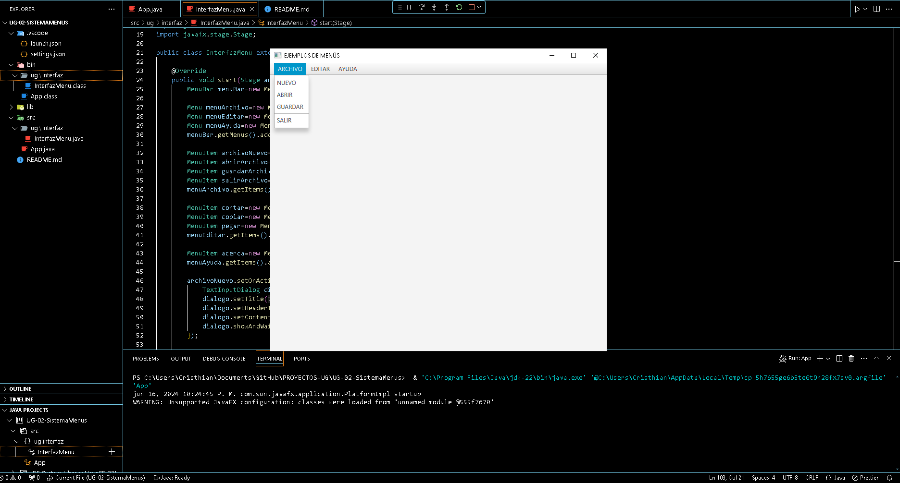
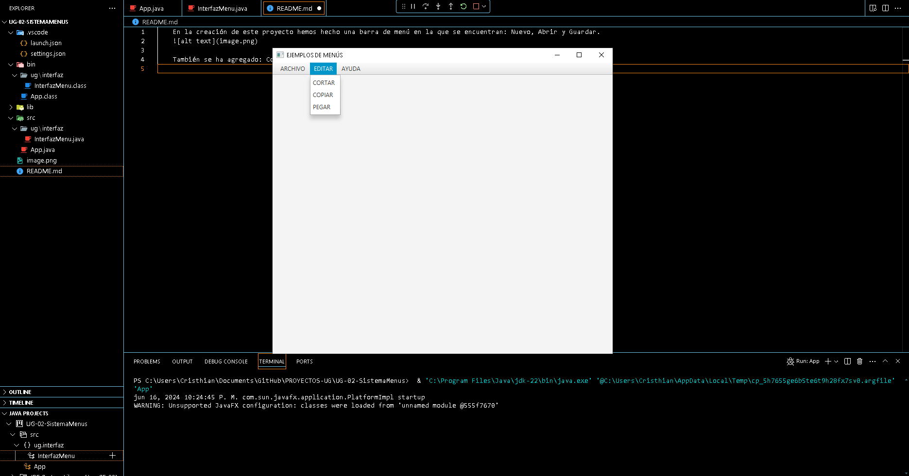
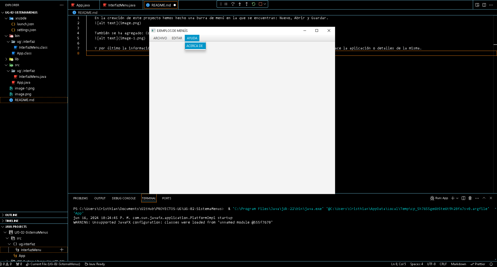
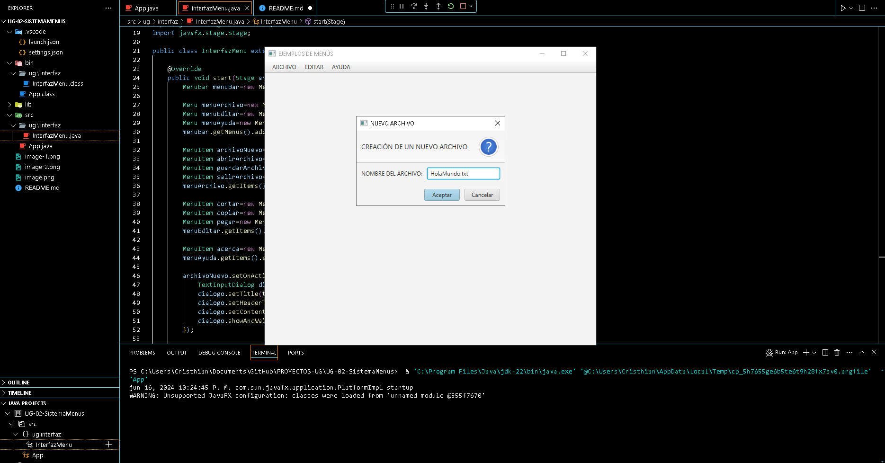
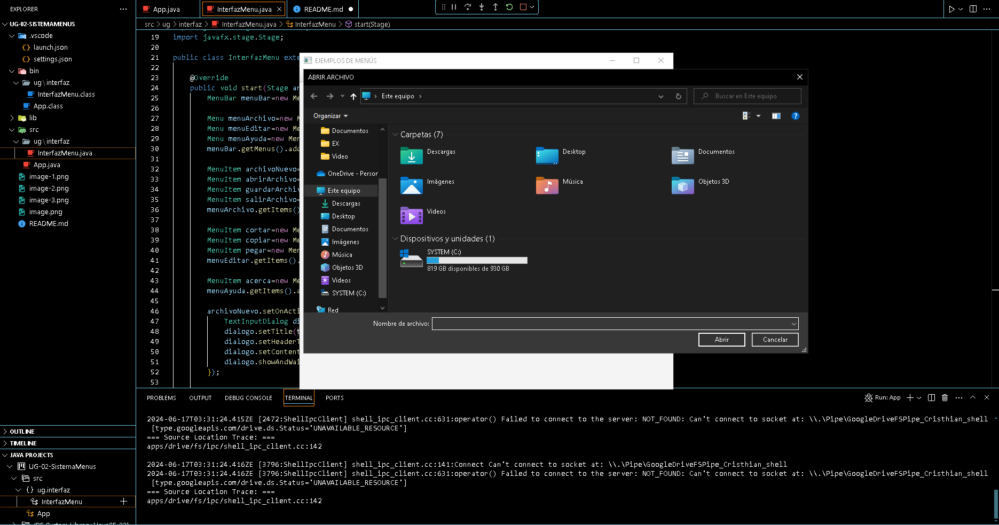
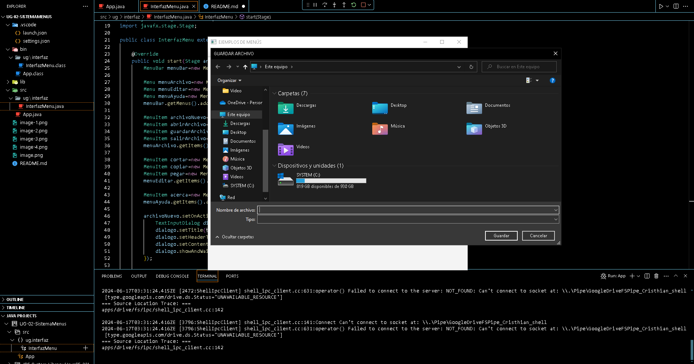
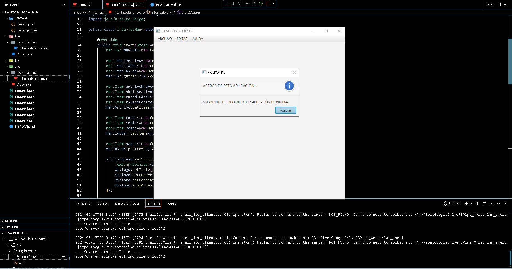

    En la creación de este proyecto hemos hecho una barra de menú en la que se encuentran: Nuevo, Abrir y Guardar.
    

    También se ha agregado: Cortar, copiar y pegar en los items de Editar.
    

    Y por último la información de la aplicación, no podía faltar el "ACERCA DE", en este podemos leer qué es o qué hace la aplicación o detalles de la misma.
    

    Ahora entre las acciones de la barra del menú, en ARCHIVO podemos observar que podemos NUEVO una aplicación, la acción es esta:
    

    Otra de la acciones del Ítem de ARCHIVO es ABRIR, la sencilla acción es este:
    

    También podemos encontrar otro ítem de ARCHIVO, la cual sería GUARDAR, el acción que llevaría acabo sería:
    

    En la barra de MENÚ, el EDITAR no contiene nada relevantes, así mismo como el ítem SALIR de ARCHIVO, aunque el SALIR si realiza una acción y es cerrar la ejecución,
    no obstante me es imposible mostrarlo en una prueba fotográfica, por lo que optaremos por mostrar el ítem de la barra de menú AYUDA.

    El ítem de AYUDA mostrará ACERCA DE, donde aquí puedes saber más de la aplicación, etc:
    

    Eso sería absolutamente todo.